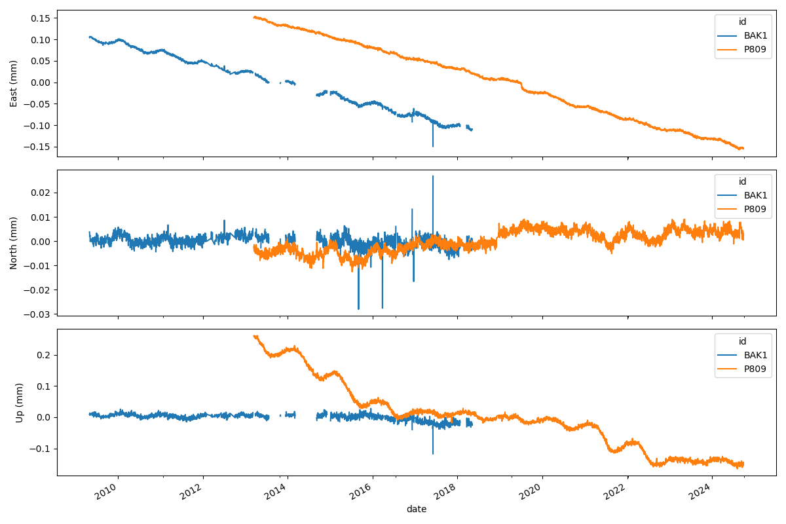

# geepers

[![Actions Status][actions-badge]][actions-link]
[![PyPI version][pypi-version]][pypi-link]
[![Documentation Status][rtd-badge]][rtd-link]

[![Conda-Forge][conda-badge]][conda-link]
[![GitHub Discussion][github-discussions-badge]][github-discussions-link]


<!-- prettier-ignore-start -->
[actions-badge]:            https://github.com/isce-framework/geepers/workflows/CI/badge.svg
[actions-link]:             https://github.com/isce-framework/geepers/actions
[conda-badge]:              https://img.shields.io/conda/vn/conda-forge/geepers
[conda-link]:               https://github.com/conda-forge/geepers-feedstock
[github-discussions-badge]: https://img.shields.io/static/v1?label=Discussions&message=Ask&color=blue&logo=github
[github-discussions-link]:  https://github.com/isce-framework/geepers/discussions
[pypi-link]:                https://pypi.org/project/geepers/
[pypi-platforms]:           https://img.shields.io/pypi/pyversions/geepers
[pypi-version]:             https://img.shields.io/pypi/v/geepers
[rtd-badge]:                https://readthedocs.org/projects/geepers/badge/?version=latest
[rtd-link]:                 https://geepers.readthedocs.io/en/latest/?badge=latest

<!-- prettier-ignore-end -->

## Overview

Geepers provides a unified interface to access GPS time series data from multiple sources and compare the time series to InSAR line-of-sight (LOS) measurements.

The current available GPS data sources are:

- `UnrSource`: [Nevada Geodetic Laboratory (UNR) GPS data](https://geodesy.unr.edu/)
- `UnrGridSource`: [Nevada Geodetic Laboratory (UNR) Gridded Data](https://geodesy.unr.edu/grid_timeseries/)
- `SideshowSource`: [Jet Propulsion Laboratory (JPL) Sideshow GPS data](https://sideshow.jpl.nasa.gov/post/series.html)

All sources implement a common interface through the `BaseGpsSource` class, making it easy to switch between data providers or combine data from multiple sources.

## Quick Start

### Basic Usage

```python
from geepers.gps_sources import UnrSource

# Create a GPS data source
unr = UnrSource()

# Get station information within a bounding box
stations = unr.stations(bbox=(-120, 35, -115, 40))  # (west, south, east, north)
print(f"Found {len(stations)} stations")
print(stations[['name', 'lat', 'lon']].head())

# Load time series data for a specific station
timeseries = unr.timeseries('P123', frame='ENU', zero_by='mean')
print(timeseries.head())

# Load data for many stations into one GeoDataFrame

df_many = unr.timeseries_many(bbox=(-115, 32, -105, 37))
print(df_many.head())
```

## Example: Comparing GPS and InSAR Data
The basic InSAR/GNSS comparison workflow is offered by the `geepers` command line tool.

```bash
geepers --los F33039_los_enu.tif --timeseries-files displacement_20160711_*tif --temporal-coherence-files temporal_coherence_*.tif --similarity-files phase_similarity*.tif
```

The results are saved in the current directory in the `GPS` folder by default.

(TODO: Example data prep for this)

### Working with Multiple Sources

```python
from geepers.gps_sources import UnrSource, SideshowSource

# Compare data from different sources
unr = UnrSource()
jpl = SideshowSource()

# Get the same station from both sources
station_id = 'P123'
unr_data = unr.timeseries(station_id, frame='ENU')
jpl_data = jpl.timeseries(station_id, frame='ENU')

print(f"UNR: {len(unr_data)} observations")
print(f"JPL: {len(jpl_data)} observations")
```

## Data Sources

### 1. UnrSource - Nevada Geodetic Laboratory (UNR)

The UNR source provides access to high-quality GPS time series data from the Nevada Geodetic Laboratory.

```python
from geepers.gps_sources import UnrSource

unr = UnrSource()

# Get all available stations
all_stations = unr.stations()

# Load time series with date filtering
data = unr.timeseries(
    'P123',
    frame='ENU',                    # 'ENU' or 'XYZ'
    start_date='2020-01-01',       # ISO format date
    end_date='2023-12-31',
    zero_by='mean',                # 'mean' or 'start'
    download_if_missing=True       # Download if not cached
)
```

Data characteristics:
- High spatial coverage
- Both ENU and XYZ coordinate frames

### 2. UnrGridSource - Nevada Geodetic Laboratory (UNR) Gridded Data

The UNR Grid source provides interpolated GPS velocities on a regular grid, useful for regional studies.

```python
from geepers.gps_sources import UnrGridSource

grid = UnrGridSource()

# Get grid points within a region
grid_points = grid.stations(bbox=(-120, 35, -115, 40))

# Load grid time series (note: different parameters)
data = grid.timeseries(
    '000123',                      # 6-digit grid point ID
    frame='ENU',                   # Only ENU supported
    plate='IGS14',                 # 'NA', 'PA', or 'IGS14'
    zero_by='mean'
)

```

Data characteristics:
- Reprocessed data onto a regular hexagonal grid (~10-20 km)
- ENU coordinates only
- Different plate reference frames
- Regional coverage

### 3. SideshowSource - Jet Propulsion Laboratory (JPL) Sideshow

[JPL's Sideshow](https://sideshow.jpl.nasa.gov/post/series.html) provides high quality processed GPS time series using the GipsyX software.

```python
from geepers.gps_sources import SideshowSource

jpl = SideshowSource()

# Get all available stations
stations = jpl.stations()

# Load time series for a specific station
data = jpl.timeseries(
    'AB01',
    frame='ENU',
    start_date='2010-01-01',
    end_date='2020-12-31'
)
```

Data characteristics:
- Reprocessed for consistency
- High precision

## Common Workflows

### 1. Regional GPS Analysis

```python
from geepers.gps_sources import UnrSource
import matplotlib.pyplot as plt

# Define study region (e.g., Southern California)
bbox = (-121, 34, -117, 36)  # (west, south, east, north)
# Get GPS stations in the region
unr = UnrSource()
stations = unr.stations(bbox=bbox)
print(f"Found {len(stations)} stations in California")

# Load data for all stations
df_all = unr.timeseries_many(bbox=bbox)
print(df_all.head())
#      id       date      east     north        up  sigma_east  sigma_north  sigma_up   corr_en   corr_eu   corr_nu         lon        lat         alt                     geometry
# 0  CHIR 2010-08-20  0.054361  0.027192 -0.007630    0.000737     0.000847  0.003072  0.058084 -0.134020 -0.073392 -109.366439  32.005681  1614.17452  POINT (-109.36644 32.00568)
# 1  CHIR 2010-08-21  0.056075  0.028543 -0.022277    0.000742     0.000844  0.003166  0.075097 -0.176761 -0.122798 -109.366439  32.005681  1614.17452  POINT (-109.36644 32.00568)
# ...


# Plot time series from 2 example stations
df = df_all[df_all.id.isin (["BAK1", "P809"])]
df_wide = df.pivot(index="date", columns=["id"], values=["east", "north", "up"])

fig, axes = plt.subplots(3, 1, figsize=(12, 8), sharex=True)
for i, component in enumerate(['east', 'north', 'up']):
    df_wide[component].plot(ax=axes[i])
    axes[i].set_ylabel(f'{component.title()} (mm)')

plt.tight_layout()
plt.show()
```



### 2. Spatial GPS Visualization

```python
import geopandas as gpd
import matplotlib.pyplot as plt
from geepers.gps_sources import UnrSource

# Get stations and plot on map
unr = UnrSource()
stations = unr.stations(bbox=(-121, 34, -117, 36))

# Create a simple map
fig, ax = plt.subplots(figsize=(10, 8))
stations.plot(ax=ax, markersize=50, alpha=0.6)

# Add basemap context
import contextily as ctx
ctx.add_basemap(ax, crs=stations.crs, source=ctx.providers.OpenStreetMap.Mapnik)

ax.set_title('GPS Stations in Southern California')
ax.set_xlabel('Longitude')
ax.set_ylabel('Latitude')
plt.show()
```

### 3. Data Quality Assessment

```python
# Assess data quality for a station
station_name = 'P123'
data = unr.timeseries(station_name)

# Basic statistics
print(f"Station: {station_name}")
print(f"Date range: {data['date'].min()} to {data['date'].max()}")
print(f"Number of observations: {len(data)}")

# Check uncertainties
print("\nUncertainty statistics (mm):")
for component in ['sigma_east', 'sigma_north', 'sigma_up']:
    sigma = data[component].describe()
    print(f"{component}: mean={sigma['mean']:.2f}, std={sigma['std']:.2f}")

# Plot uncertainties over time
fig, ax = plt.subplots(figsize=(12, 6))
for component, sigma_col in [('East', 'sigma_east'), ('North', 'sigma_north'), ('Up', 'sigma_up')]:
    ax.plot(data['date'], 1000 *data[sigma_col], label=f'{component} σ', alpha=0.7)

ax.set_ylabel('Uncertainty (mm)')
ax.set_xlabel('Date')
ax.legend()
ax.set_title(f'GPS Uncertainty Time Series - {station_name}')
plt.show()
```

### 4. Multi-Source Comparison

```python
from geepers.gps_sources import UnrSource, SideshowSource

# Compare UNR and JPL data for the same station
station_id = 'P123'
unr = UnrSource()
jpl = SideshowSource()

# Load data from both sources
unr_data = unr.timeseries(station_id, start_date='2015-01-01', end_date='2020-12-31')
jpl_data = jpl.timeseries(station_id, start_date='2015-01-01', end_date='2020-12-31')

# Merge on date for comparison
import pandas as pd
comparison = pd.merge(unr_data, jpl_data, on='date', suffixes=('_unr', '_jpl'))

# Plot comparison
fig, axes = plt.subplots(3, 1, figsize=(12, 10), sharex=True)
components = ['east', 'north', 'up']

for i, comp in enumerate(components):
    axes[i].plot(comparison['date'], comparison[f'{comp}_unr'],
                label='UNR', alpha=0.7)
    axes[i].plot(comparison['date'], comparison[f'{comp}_jpl'],
                label='JPL', alpha=0.7)
    axes[i].set_ylabel(f'{comp.title()} (mm)')
    axes[i].legend()

    # Calculate RMS difference
    diff = comparison[f'{comp}_unr'] - comparison[f'{comp}_jpl']
    rms = (diff**2).mean()**0.5
    axes[i].set_title(f'{comp.title()} - RMS difference: {rms:.2f} mm')

plt.xlabel('Date')
plt.suptitle(f'GPS Data Comparison: UNR vs JPL - Station {station_id}')
plt.tight_layout()
plt.show()
```

## Advanced Usage

### Custom Cache Directory

```python
from geepers.gps_sources import UnrSource

# Use custom cache directory
unr = UnrSource(cache_dir='/path/to/my/cache')
```

### Filtering by Geometry

```python
from shapely.geometry import Polygon
import geopandas as gpd

# Define a custom polygon (e.g., California outline)
california_poly = Polygon([
    (-125, 32), (-114, 32), (-114, 42), (-125, 42), (-125, 32)
])
california_mask = gpd.GeoSeries([california_poly], crs='EPSG:4326')

# Get stations within the polygon
stations = unr.stations(mask=california_mask)
```

### Batch Processing

```python
import concurrent.futures
from tqdm import tqdm

def load_station_data(station_name):
    """Load data for a single station."""
    try:
        return station_name, unr.timeseries(station_name)
    except Exception as e:
        return station_name, None

# Get list of stations
stations = unr.stations(bbox=(-120, 35, -115, 40))
station_names = stations['name'].tolist()

# Load data in parallel
results = {}
with concurrent.futures.ThreadPoolExecutor(max_workers=5) as executor:
    futures = [executor.submit(load_station_data, name) for name in station_names]

    for future in tqdm(concurrent.futures.as_completed(futures),
                      total=len(futures), desc="Loading GPS data"):
        station_name, data = future.result()
        if data is not None:
            results[station_name] = data

print(f"Successfully loaded data for {len(results)} stations")
```

## Data Schema and Validation

See `geepers.schemas` for more information about the [Pandera](https://pandera.readthedocs.io/en/stable/index.html) data schemas.
